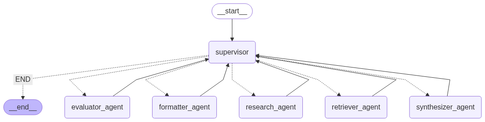

# Advanced RAG Agent with LangGraph and Google Gemini

## Project Overview
This project implements an intelligent Retrieval-Augmented Generation (RAG) agent capable of answering complex user queries by leveraging a local knowledge base (ChromaDB) and Google's Gemini models for advanced reasoning and text generation. Built with `langgraph`, this agent demonstrates a robust, multi-step, and self-correcting research and synthesis workflow.

## Architecture



## Features
The RAG agent is structured into several interconnected phases, each handled by specialized "agent nodes":

### Knowledge Base Construction (Phase 1)
- **Document Loading:** Supports various document types (PDF, Markdown, Text).
- **Text Chunking:** Divides documents into manageable segments.
- **Embedding Generation:** Converts text chunks into vector embeddings using GoogleGenerativeAIEmbeddings.
- **Vector Database Storage:** Stores chunks and their embeddings in a persistent ChromaDB instance locally.

### Multi-Step Query Decomposition & Research Orchestration (Phase 3)
- **Research Agent:** Breaks down a complex user query into smaller, more focused sub-queries using Gemini. It also manages the processing flow for each sub-query.
- **Supervisor Agent:** Acts as the central orchestrator, directing the flow between different agent nodes based on the current state and task at hand.

### Intelligent Information Retrieval & Self-Correction (Phase 2)
- **Retriever Agent:** Fetches the most relevant document chunks from ChromaDB for a given sub-query. Configurable to return top-K results.
- **Evaluator Agent:** Utilizes Gemini to assess the sufficiency and relevance of the retrieved chunks to answer the `current_sub_query`.
- **Self-Correction Loop:** If retrieved information is deemed insufficient, the Evaluator provides feedback (e.g., "try more specific keywords"), and the agent can re-attempt retrieval for the same sub-query, up to a defined maximum number of attempts.

### Answer Synthesis & Refinement (Phase 4)
- **Synthesizer Agent:** Gathers all successfully retrieved and evaluated chunks for all sub-queries and synthesizes them into a comprehensive draft answer to the `original_query` using Gemini. It acknowledges any parts of the query that could not be answered.
- **Formatter Agent:** Polishes the draft answer for clarity, conciseness, grammar, tone, and professional presentation using Gemini, preparing it for the end-user.

## Architecture
The agent's intelligence and workflow are powered by `langgraph`, a library for building robust, stateful, multi-actor applications with LLMs. The core components are:

- **AgentState (TypedDict):** The central memory or "state" that is passed between all agent nodes. It holds the `original_query`, `sub_queries_list`, `retrieved_chunks`, `accumulated_relevant_chunks`, `final_answer`, and flags for `next_agent_to_call`, among others.
- **Nodes (Agent Functions):** Each feature listed above is implemented as a Python function (a "node") that takes the AgentState as input, performs its specific task, updates the state, and sets `next_agent_to_call` to indicate the desired next step.
- **Supervisor Node:** This special node reads `next_agent_to_call` from the state and determines the actual next node to execute, acting as the routing logic.
- **Conditional Edges:** `langgraph` allows defining transitions based on the state, enabling complex loops and decision-making within the agent's workflow (e.g., retry retrieval, move to next sub-query, or end research).

## Setup and Installation

### 1. Clone the Repository
```bash
git clone <your-repo-link>
cd <your-repo-name>
```

### 2. Create a Virtual Environment (Recommended)
```bash
uv venv venv
# On Windows:
venv\Scripts\activate
# On macOS/Linux:
source venv/bin/activate
```

### 3. Install Dependencies
The project relies on `langchain`, `langgraph`, `chromadb`, `google-generativeai`, `python-dotenv`, `unstructured`, and `markdown`.

```bash
uv pip install -r requirements.txt
```

**requirements.txt content:**
```text
langchain
langchain-google-genai
chromadb
python-dotenv
unstructured
ipykernel
langgraph
langchain-community
```

### 4. Set Up Google API Key
You'll need a Google API Key for accessing Gemini models.

1. Go to [Google AI Studio](https://makersuite.google.com/app/apikey).
2. Create or retrieve an API key.
3. Create a file named `.env` in the root directory of your project.
4. Add your API key to the `.env` file like this:

```env
GEMINI_API_KEY="YOUR_API_KEY_HERE"
```

## Usage
The project consists of two main parts: building the knowledge base and running the RAG agent.

### 1. Build the Knowledge Base (Phase 1)
This script processes your raw documents and creates the local ChromaDB vector store.

- **Place your documents:** Ensure your `.txt`, `.md`, or `.pdf` documents are in the `data/documents` directory (relative to your script execution location, as defined by `RAW_DOCS_DIR`).

- **Run the script:**

```bash
python scripts/build_knowledge_base.py
```

This will create a `chroma_db` directory (default: `../chroma_db` relative to scripts/) containing your vector database. You only need to run this once, or whenever you add/update documents.

### 2. Run the RAG Agent (Phases 2, 3, & 4)
This script orchestrates the entire RAG agent workflow, from query decomposition to final answer generation.

- **Ensure Knowledge Base is Built:** Make sure you've run `build_knowledge_base.py` at least once.

- **Run the agent:**

```bash
python scripts/rag_agent_core.py
```

- **Modify the test query:** In `rag_agent_core.py`, find the `test_original_query` variable within the `if __name__ == "__main__":` block. Change it to your desired complex query.

```python
# Example test query
test_original_query = "Tell me how to set up the Zenith Smart Thermostat, including Wi-Fi connection, and how to troubleshoot common power and Wi-Fi issues."
```

The console output will display the agent's step-by-step reasoning, retrieval attempts, evaluations, and finally, the synthesized and formatted answer.

## Project Structure
```
.
├── .env                  (Your Google API Key)
├── requirements.txt      (Python dependencies)
├── data/
│   └── documents/        (Your raw PDF, MD, TXT documents go here)
├── chroma_db/            (Automatically generated by build_knowledge_base.py)
│   └── ...               (ChromaDB internal files)
├── build_knowledge_base.ipynb  (Phase 1: Ingests documents into ChromaDB)
├── main.ipynb            (Phases 2-4: The main RAG agent workflow)
```

## Future Enhancements
- **Query Refinement Agent:** Introduce an agent that refines sub-queries based on evaluator feedback before re-attempting retrieval.
- **Human-in-the-Loop:** Implement a mechanism to allow human intervention when the agent gets stuck or identifies an unanswerable query.
- **Tool Use:** Integrate external tools (e.g., web search for out-of-knowledge-base queries, calculators).
- **Chat Interface:** Build a simple web UI (e.g., with Streamlit or Flask) to interact with the agent.
- **Evaluation Metrics:** Add automated evaluation to measure the quality of retrieved chunks and generated answers.
- **Heterogeneous Data Sources:** Expand to retrieve from multiple types of databases or APIs.
